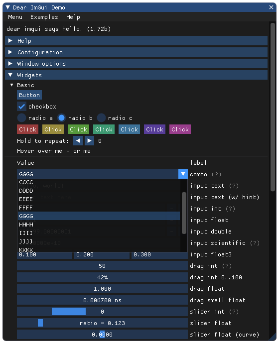

# imgui-rs-vulkan-renderer

[](https://crates.io/crates/imgui-rs-vulkan-renderer)
[](https://docs.rs/imgui-rs-vulkan-renderer)
[](https://github.com/adrien-ben/imgui-rs-vulkan-renderer/actions)
[](https://github.com/adrien-ben/imgui-rs-vulkan-renderer/actions)

A Vulkan renderer for [imgui-rs][imgui-rs] using [Ash][ash].



## How it works

The renderer records drawing command to a command buffer supplied by the application. Here is a little breakdown of the features of this crate and how they work.

- Vertex/Index buffers

The renderer creates a vertex buffer and a index buffer that will be updated every time
`Renderer::cmd_draw` is called. If the vertex/index count is more than what the buffers can
actually hold then the buffers are resized (actually destroyed then re-created).

- Frames in flight

The renderer support having multiple frames in flight. You need to specify the number of frames
during initialization of the renderer. The renderer manages one vertex and index buffer per frame.

- No draw call execution

The `Renderer::cmd_draw` only record commands to a command buffer supplied by the application. It does not submit anything to the gpu.

- Custom textures

The renderer supports custom textures. See `Renderer::textures` for details.

- Custom Vulkan allocators

Custom Vulkan allocators are not supported for the moment.

## Integration

You can find an example of integration in the [common module](examples/common/mod.rs) of the examples.

### The `RendererVkContext` trait

You need to implement that trait that will be used to access Vulkan resources such as the instance and device.

### The `Renderer` struct

This is the main struct of the renderer. It has 3 function:

- `Renderer::new` create and initialize the renderer. It takes:
  - A reference to a struct implementing `RendererVkContext`
  - The number of frames in flight of the application
  - The `RenderPass` use during rendering

- `Renderer::cmd_draw` records commands required to render the ui. It takes:
  - A reference to a struct implementing `RendererVkContext`
  - A `CommandBuffer` to record commands to
  - A reference to the `DrawData` generated by imgui-rs

- `Renderer::destroy` release all gpu resources allocated by the renderer. It takes:
  - A reference to a struct implementing `RendererVkContext`

`Renderer::new` and `Renderer::cmd_draw` return a `RendererResult` which is defined as follows:

```rust
type RendererResult<T> = Result<T, RendererError>;
```

## vk-mem support

The [vk-mem-rs][vk-mem-rs] is now supported via the `vkmem` feature.

When enabled you'll need to implement `RendererVkContext::vk_mem_allocator` to return a reference
to a `vk_mem::Allocator`. Then call `Renderer::with_vk_mem_allocator` instead of `Renderer::new`
to create a Renderer.

## Examples

You can run a set of examples by running the following command:

```sh
# If you want to enable validation layers
export VK_LAYER_PATH=$VULKAN_SDK/Bin
export VK_INSTANCE_LAYERS=VK_LAYER_KHRONOS_validation

# If you changed the shader code (you'll need glslangValidator on you PATH)
# There is also a PowerShell version (compile_shaders.ps1)
./compile_shaders.sh

# Run an example
cargo run --example <example>

# Example can be one of the following value:
# - collapsing_header
# - color_button
# - custom_textures
# - hello_world
# - progress_bar
# - radio_button
# - test_drawing_channels_split
# - test_window_impl
# - test_window
```

[imgui-rs]: https://github.com/Gekkio/imgui-rs
[ash]: https://github.com/MaikKlein/ash
[vk-mem-rs]: https://github.com/gwihlidal/vk-mem-rs